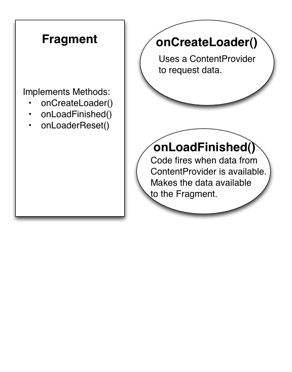
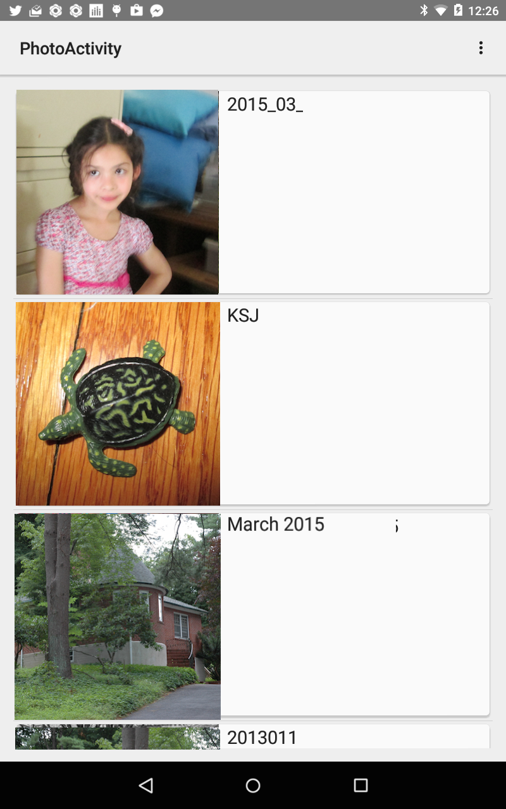

# Hour 20 - Using Cursor Loaders

Example Application that uses Loaders and ContentProviders.

###From Hour 20:
**How Loaders Work**

*Loaders help to asynchronously load data in a fragment or activity. So far, you have learned about downloading data, writing to a SQLite database, and creating a content provider. You’ll put all of that together to a CursorLoader to work with data downloaded from Flickr.*

*Loaders monitor the source of their data and provide updates when the data changes. Much of the work that is commonly done in a data-driven app is done in a streamlined way using loaders.*

*Loaders retain their data after being stopped. That means that if an activity or fragment that uses a loader is stopped, the data in the loader is retained. When the fragment starts again, the data is available and the fragment does not need to wait for the data to reload.*

Relationship of a fragment to LoaderManagerCallback methods:

**MainActivity.java** - provides options to just get photo data from Flickr API  or display the photos  

**RetrievePhotosActivity.java** - demonstrates using an IntentService and a BroadcastReceiver to retrieve data in the background. A broadcast is sent when data becomes available.  RetrievePhotoService.java is the IntentService and the BroadcastReceiver is in RetrievePhotosActivity.java.

**PhotoActivity.java** -  Retrieves and display photos using a Loader using a Content Provider.
Data is retrieved the IntentService PhotoService.java.  Data is updated using the ContentProvider FlickrPhotoContentProvider.java. The ContentProvider uses FlickrPhotoDBAdapter to update the SQLite database.

PhotoActivity Screenshot

